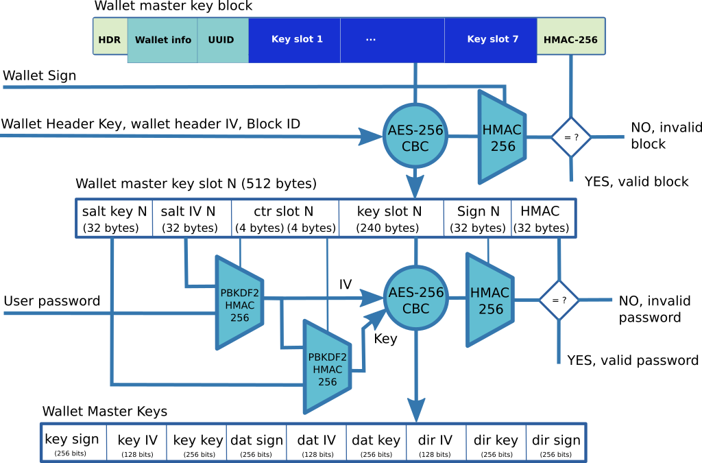
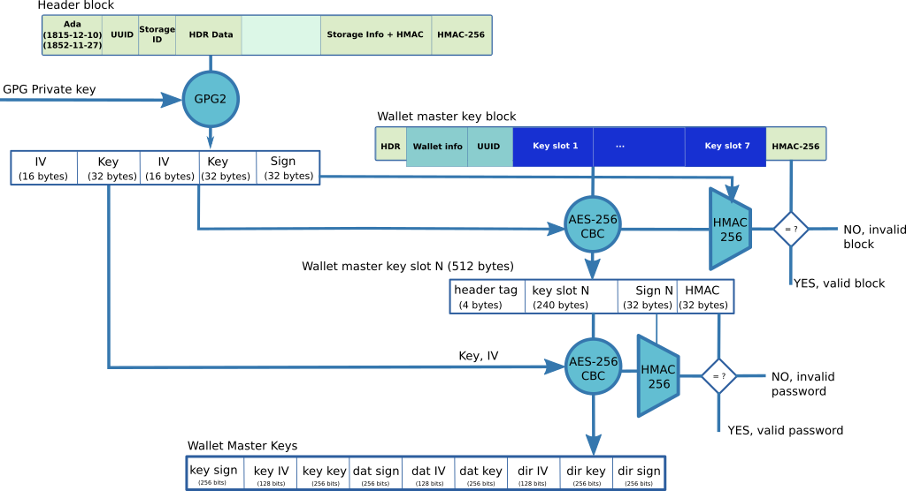
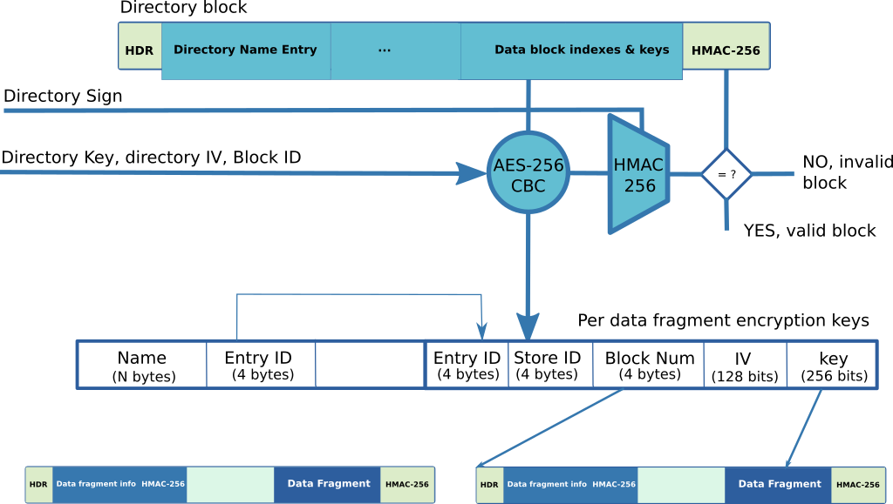

## Keystore Protections

The master key block contains the primary keys that are used to encrypt
other blocks.  The master key block contains 7 key slots that are
capable to unlock the master keys.  Each slot is independent and
can be associated with a specific authentication method.
Two authentication methods are supported:

* password based authentication,
* GPG based authentication.

### Password Protection

In this mode, three secret information must be provided:

* the wallet header key and IV,
* the wallet signature key,
* the user password.

First, the wallet master key block is decrypted with AES-256-CBC
by using the wallet header key and IV.  The HMAC-256 signature
is then computed with the wallet signature key on the decrypted
content and the clear 16-byte header at beginning of the block.
The HMAC signature must match the signature found at end of
the block.

Once the wallet master key block is decrypted, the user password
is checked against the available key slots.  For a given password
protected key slot, a derived key is generated by using
the PBKDF2-HMAC256 algorithm.  First, a 16-byte IV is generated
and then a 32-byte key is generated.  For each PBKDF2 execution
a specific 32-byte salt and counter is used.  The key slot
is then decrypted by using the derived keys with AES-256-CBC.
An HMAC-256 signature is built to verify the decrypted content.
When the HMAC signature matches the signature found in the key
slot, the provided user's password is valid.

### GPG Protection

With the GPG protection, the header block contains additional
information that is decrypted with the user's GPG private key.
When such additional data is successfully decrypted, it contains
several parts:

* the wallet header key and IV,
* the wallet signature key,
* the key slot encryption key and IV.

The wallet master key block is decrypted and validated using
the same process as the password protection.

The key slot that matches the GPG key is identified by a header tag
that is found in the key slot and in the GPG header data.
The key slot is decrypted by using the key slot encryption key
and IV that was decrypted by GPG.  It is validated using
HMAC-256.

### Directory Protection

A directory block contains the name of contents found in the keystore
as well as the keys used to encrypt data fragments.
The directory block is decrypted with AES-256-CBC by using the
directory key and IV.  The directory block number is xored on
the directory IV to obtain the IV used for the decryption.
An HMAC-256 signature is computed with the clear 16-byte header
and the decrypted directory content.  It is then verified against
the block HMAC.

Once decrypted, the directory block contains two areas.
At beginning of the block, it contains the entry names that
are stored in the keystore.  For each entry, a unique entry ID
is assigned and is used as a unique reference.

At end of the block, it contains the encryption keys and the
block numbers where the data fragments are stored.  Each data fragment
has its own encryption key and IV.

